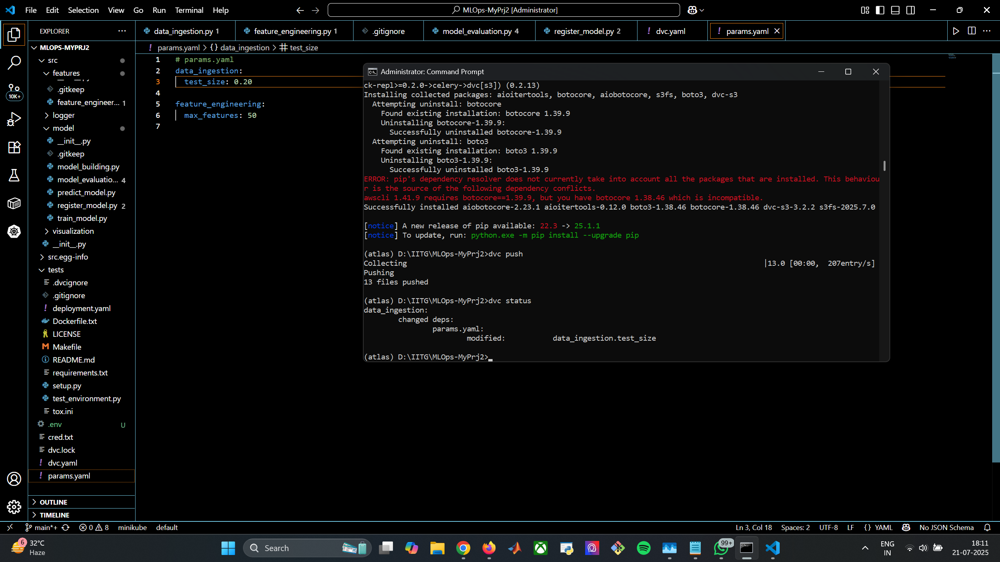
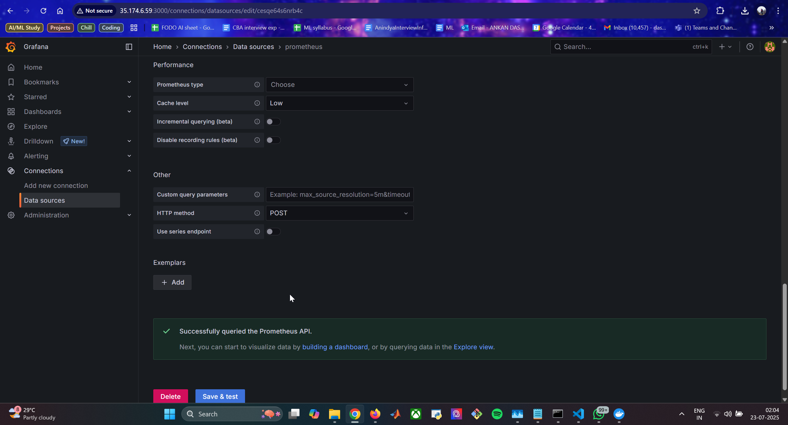

End-to-End Sentiment Analysis MLOps Pipeline

This repository contains a complete, end-to-end MLOps project that automates the training, evaluation, deployment, and monitoring of a sentiment analysis model. The entire workflow is orchestrated through a CI/CD pipeline, deploying the final application as a containerized service on Amazon EKS.

Overview

The core of this project is a Logistic Regression model trained to classify text as either 'positive' or 'negative'. The project's main goal is not just to build a model, but to build a robust, automated system around it. This includes versioning data, tracking experiments, containerizing the application, and deploying it to a scalable Kubernetes cluster, complete with monitoring for performance and health.

Key Features

Automated CI/CD Pipeline: Uses GitHub Actions to automatically test, build, and deploy the application on every code push.

Data & Pipeline Versioning: Leverages DVC to version large data files and define the ML pipeline stages (dvc.yaml).

Experiment Tracking: Integrates with MLflow (hosted on DagsHub) to log model parameters, metrics, and artifacts for every run.

Containerization: The final Flask application is containerized using Docker and pushed to Amazon ECR (Elastic Container Registry).

Cloud-Native Deployment: Deploys the containerized application to a Kubernetes cluster managed by Amazon EKS (Elastic Kubernetes Service).

Infrastructure as Code: Uses eksctl to programmatically create and manage the EKS cluster and its resources.

Application Monitoring: A Prometheus server scrapes custom metrics from the Flask application's /metrics endpoint, and Grafana is set up for visualization.

Project Workflow & Architecture

The project follows a standard MLOps workflow, triggered by a git push to the main branch.

CI Trigger: The GitHub Actions workflow begins.

Setup & Install: A Python environment is set up, and all dependencies from requirements.txt are installed. The local src package is also installed.

ML Pipeline Execution: dvc repro is run, which executes the stages defined in dvc.yaml:

data_ingestion: Downloads and splits the raw data.

data_preprocessing & feature_engineering: Cleans the text data and converts it into numerical features (BoW).

model_building: Trains the Logistic Regression model.

model_evaluation: Evaluates the model on the test set and logs metrics to MLflow.

register_model: Registers the newly trained model in the MLflow Model Registry and promotes it to the "Staging" stage.

Testing & Promotion:

Automated tests are run against the model.

A script promotes the model from "Staging" to "Production" in the registry.

Containerization & Push:

A Docker image of the Flask application is built.

The image is tagged and pushed to a private Amazon ECR repository.

Kubernetes Deployment:

kubectl apply updates the Kubernetes cluster with the new deployment configuration, pointing to the latest Docker image in ECR.

EKS pulls the new image and performs a rolling update, ensuring zero downtime.

Monitoring:

The live application exposes metrics at its /metrics endpoint.

A separate Prometheus server, running on an EC2 instance, scrapes this endpoint to collect data.

A Grafana server, also on an EC2 instance, connects to Prometheus as a data source to visualize application performance.

Challenges & Key Learnings

Deploying a real-world MLOps pipeline presents numerous challenges. This project was no exception, and overcoming these hurdles provided critical insights.

1. Environment and PATH Conflicts

Challenge: Initial attempts to run eksctl and aws commands failed with 'is not recognized' errors, even after installation.

Diagnosis: Using the where <command> utility revealed that multiple versions of these tools were installed on the system (e.g., one from a manual install in System32, another by chocolatey). The system PATH was prioritizing the outdated version.

Learning: Always ensure your system's PATH is clean and points to a single, correct installation of a command-line tool. Restarting the terminal after installation or PATH modification is crucial for changes to take effect.

2. Cloud Service and Local Tool Version Mismatch

Challenge: The eksctl create cluster command failed, reporting that the requested Kubernetes version (e.g., 1.25) was unsupported by AWS EKS. However, attempting to use a newer version (e.g., 1.29) resulted in an error from the eksctl tool itself.

Diagnosis: The version of the eksctl executable was too old and did not know how to provision modern Kubernetes versions, even though the cloud service required it.

Learning: Infrastructure-as-code tools like eksctl must be kept up-to-date to remain compatible with the ever-evolving cloud provider APIs. A simple choco upgrade eksctl resolved the conflict.

3. EKS Pod Deployment Failure (ImagePullBackOff)

Challenge: After a seemingly successful deployment, kubectl get pods showed the application pods were stuck in an ImagePullBackOff or ErrImagePull state. The curl command to the load balancer returned an empty reply.

Diagnosis: This was a multi-step debugging process:

The first assumption was a missing IAM permission. The AmazonEC2ContainerRegistryReadOnly policy was correctly attached to the EKS node's IAM role.

When the error persisted, kubectl describe pod <pod-name> was used to get a more detailed error message.

The detailed event logs revealed a 403 Forbidden error and, crucially, showed the exact image URI the pod was trying to pull.

Comparing this URI with the output of aws ecr describe-repositories revealed the root cause: the AWS Account ID in the deployment.yaml was incorrect.

Learning: ImagePullBackOff is a generic error. kubectl describe pod is the most critical tool for diagnostics, as it provides the specific underlying reason (e.g., 403 Forbidden, manifest not found). Always verify that the image URI in your Kubernetes deployment manifest is a 100% exact match with the image URI in your container registry.

Project Visuals

![This screenshot shows the MLflow Parallel Coordinates Plot, which was essential for the initial model selection phase of the project. This powerful visualization compares multiple experiment runs at once, testing different classification algorithms (such as XGBoost, Logistic Regression, and Random Forest) against different text feature engineering techniques (BoW and TF-IDF). Each line represents a single training run. The lines are colored by the accuracy metric, making it easy to identify the top-performing model-feature combinations at a glance. This chart was crucial for quickly narrowing down the options and justifying the choice of the final model that was carried forward for deployment.](screenshots/MLflow Model & Feature Comparison.png)

![To enable effective monitoring, the Flask application was instrumented using the Prometheus client library. This screenshot shows the raw output of the /metrics endpoint, which exposes custom telemetry in a format that the Prometheus server can understand and scrape. Key metrics being tracked include app_request_count (total requests per endpoint), app_request_latency_seconds (a histogram of request durations), and model_prediction_count (a counter for each class predicted), providing deep insight into the application's real-time behavior.](screenshots/Exposing Custom Application Metrics.png)

